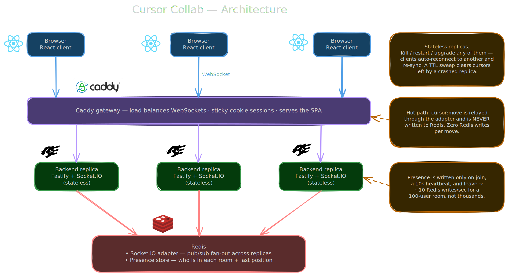
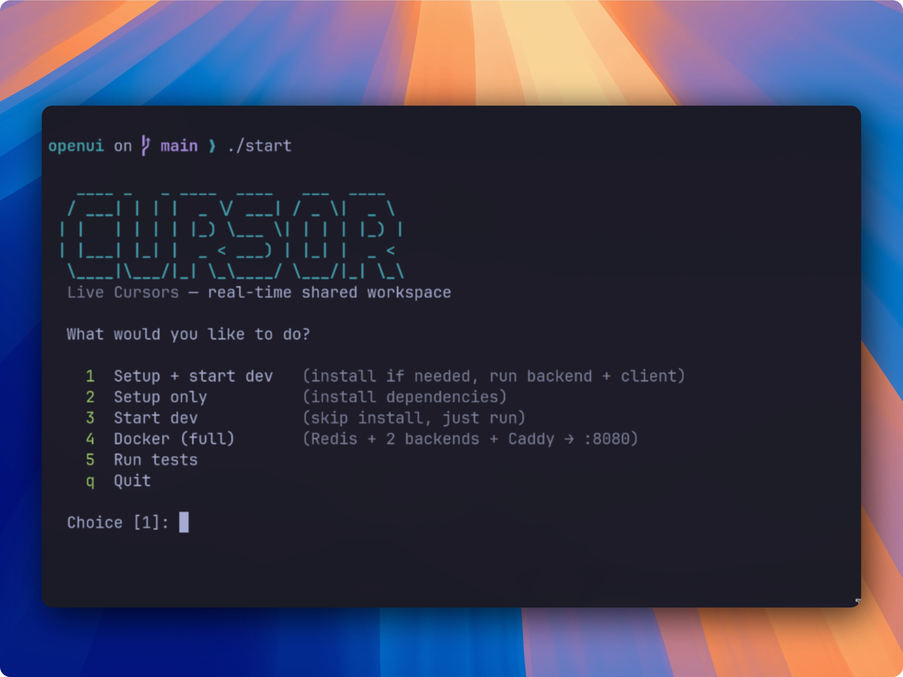
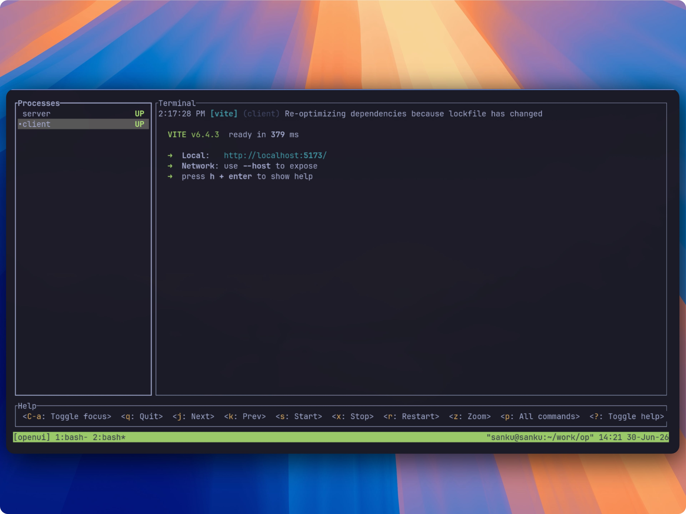

<p align="center">
  
</p>

<h1 align="center">Cursor Collab</h1>

<p align="center">
  Real-time shared workspace where everyone sees each other's cursor move live.
</p>

<p align="center">
  
  
  
  
  
  
</p>


## Architecture Decision

<p align="center">
  
</p>

we are using caddy as the gateway and fastify as the backend framework, with react on the frontend.

when a user first visits the site there is no cookie set, so caddy assigns them to a backend at random. on return visits the cookie pins them to the same backend. this matters because socket.io's handshake has to keep hitting the same server. if it bounces to another backend mid-handshake the connection breaks.

this is set in the caddy config:
```
	reverse_proxy backend1:3001 backend2:3001 {
			lb_policy cookie
		}
```

caddy also serves the built react app, so there's a single entry point for both the client and the websockets.

for now we run 2 backend containers, `backend1` and `backend2`, but it can be scaled to as many as we want. once a user hits a backend we store their session in redis so every backend can read it. redis does one more job too: it relays cursor moves between backends over pub/sub, so a move made by someone on `backend1` still reaches users connected to `backend2`. without that, people on different backends couldn't see each other.

we use docker swarm for now to keep deployment simple, but we can move to k8s later if it gets more complex.

rn caddy serves a built SPA react app just for now but we can deploy it in cloudflare CDN later on if we want

## Folder structure

organised feature-wise (vertical slices). reference: [Vertical Codebase](https://tkdodo.eu/blog/the-vertical-codebase)


## Set Up

from a fresh clone, `./start` bootstraps pnpm, installs dependencies, and runs the backend + client together:

```bash
./start
```

<p align="center">
  
  
</p>


For the full load-balanced topology (Redis, two backends, and a Caddy gateway) use:

```bash
./start --docker        # same as: docker compose up --build  → http://localhost:8080
```

### Running the pieces by hand

1. install dependencies

```bash
pnpm install
```

2. start redis (the backend connects to `redis://localhost:6379` by default)

```bash
docker compose up -d redis
```

3. start the backend (one terminal)

```bash
pnpm dev:server   # → :3001
```

4. start the client (another terminal)

```bash
pnpm dev:client   # → :5173
```

open http://localhost:5173 in two windows and move your mouse. add `?room=design` to the url to pick a room.

## Test it

Integration tests run real Socket.IO clients against the server (join, broadcast, disconnect, validation):

```bash
pnpm test
```

The load test simulates a crowd and measures real end-to-end latency, from a mouse move on one client, through the server, to another client's socket:

```bash
# start a server first, then:
URL=http://localhost:8080 USERS=1000 ROOMS=10 pnpm loadtest
```


## Deploying multiple servers

See [DEPLOY.md](DEPLOY.md). It covers the local Docker topology, scaling with Docker Swarm (one machine or several), and what a real deployment needs: shared Redis, a sticky-session load balancer, and health checks.
