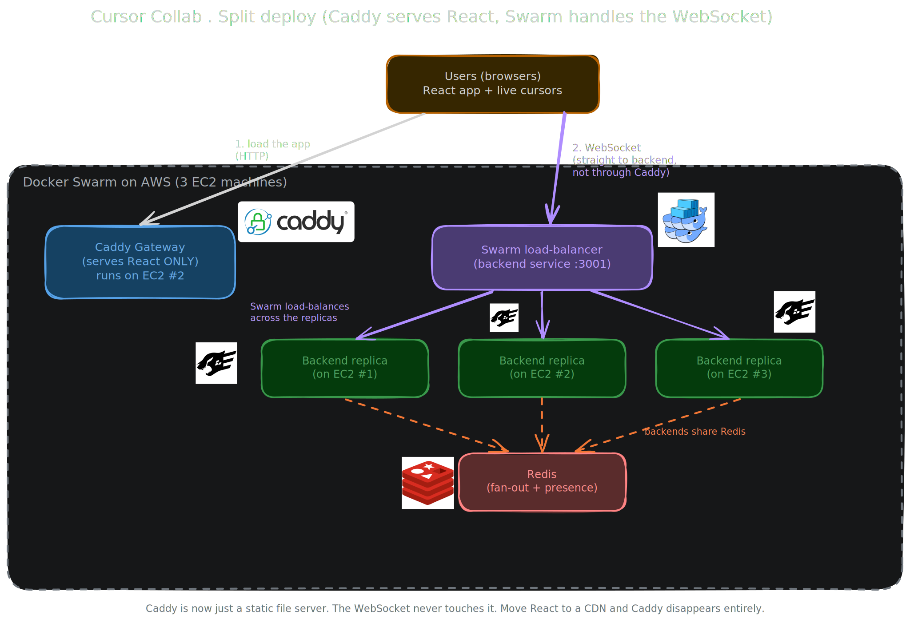

<p align="center">
  
</p>

<h1 align="center">Cursor Collab</h1>

<p align="center">
  Real-time shared workspace where everyone sees each other's cursor move live.
</p>

<p align="center">
  
  
  
  
  
  
</p>

## Set Up

From a fresh clone, `./start` bootstraps pnpm, installs dependencies, and runs the backend + client together:

```bash
./start
```

<p align="center">
  
  
</p>

### Manual

```bash
pnpm install
docker compose up -d redis    # the backend connects to it
pnpm dev:server               # → :3001
pnpm dev:client               # → :5173  (open in two windows)
```

## How it works

<p align="center">
  
</p>

The browser loads the React app from **Caddy**, then opens a **WebSocket straight to the backend**, where **Docker Swarm load-balances** it across N stateless **Fastify + Socket.IO** replicas.

**Redis does two jobs:**

- **Adapter (fan-out).** A backend can only reach its *own* clients. So it publishes cursor moves to Redis; the other backends are subscribed and deliver to theirs. This is what lets people on different backends see each other.
- **Presence.** A shared list of who's in each room, so a late joiner instantly sees everyone already there. It also backs crash recovery.

Backends are **stateless** (all shared state is in Redis), so any can be killed or restarted freely; a TTL sweep clears cursors left by a crashed one. The client throttles moves to ~60/sec so a fast mouse never floods the server.

Editable diagram source: [`docs/architecture-split.excalidraw`](docs/architecture-split.excalidraw) (open in [Excalidraw](https://excalidraw.com)).

## Deploy

- **One machine** (dev/demo): `docker compose up --build` → http://localhost:8080
- **Many machines** (production, incl. AWS): Docker Swarm across N nodes, `docker stack deploy`.

Full runbook (ECR, EC2, swarm, scaling, teardown) in [DEPLOY.md](DEPLOY.md).

## Test

```bash
pnpm test                                         # integration (real socket clients)
URL=http://localhost:3001 USERS=100 pnpm loadtest # 100+ concurrent users, latency percentiles
pnpm test:e2e                                     # end-to-end in real browsers
```

## Structure

Organised feature-wise (vertical slices). Reference: [Vertical Codebase](https://tkdodo.eu/blog/the-vertical-codebase).
